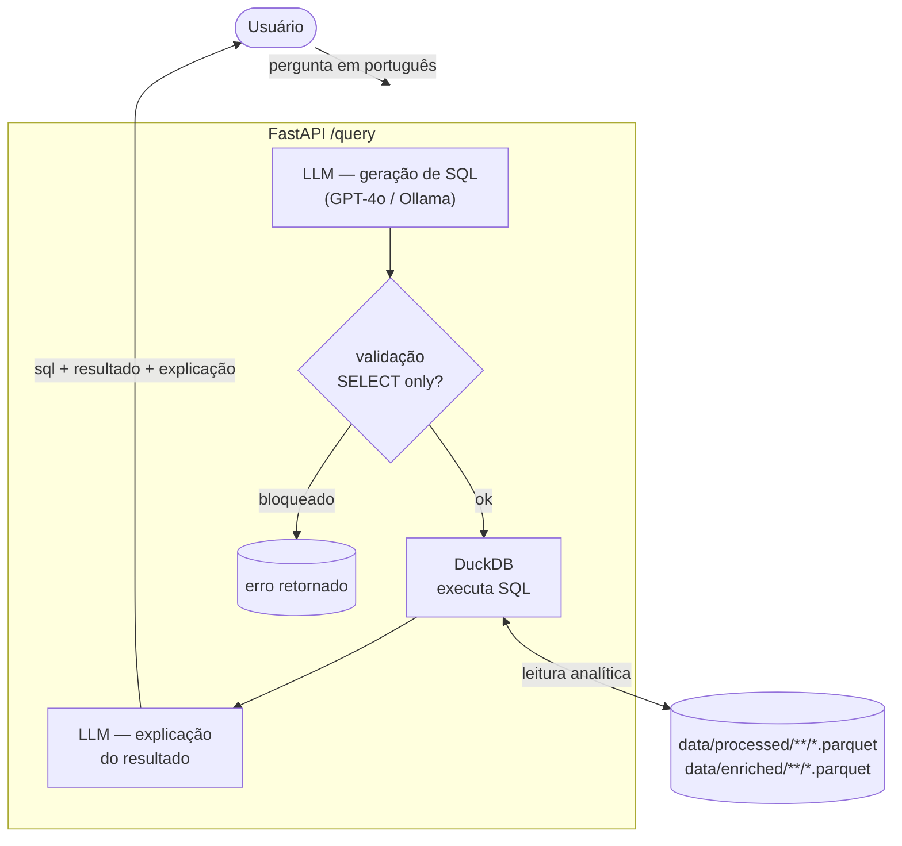
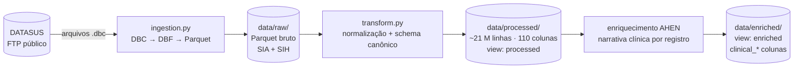
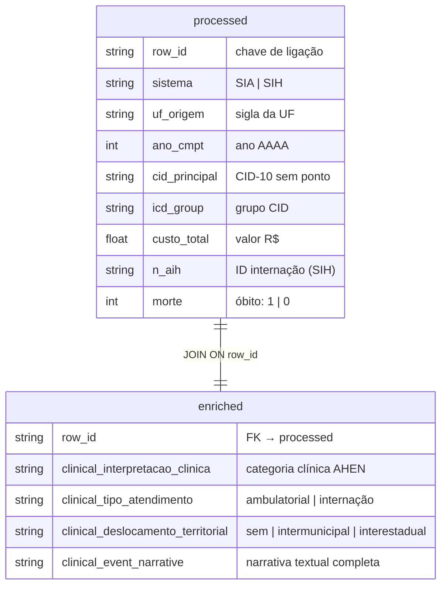
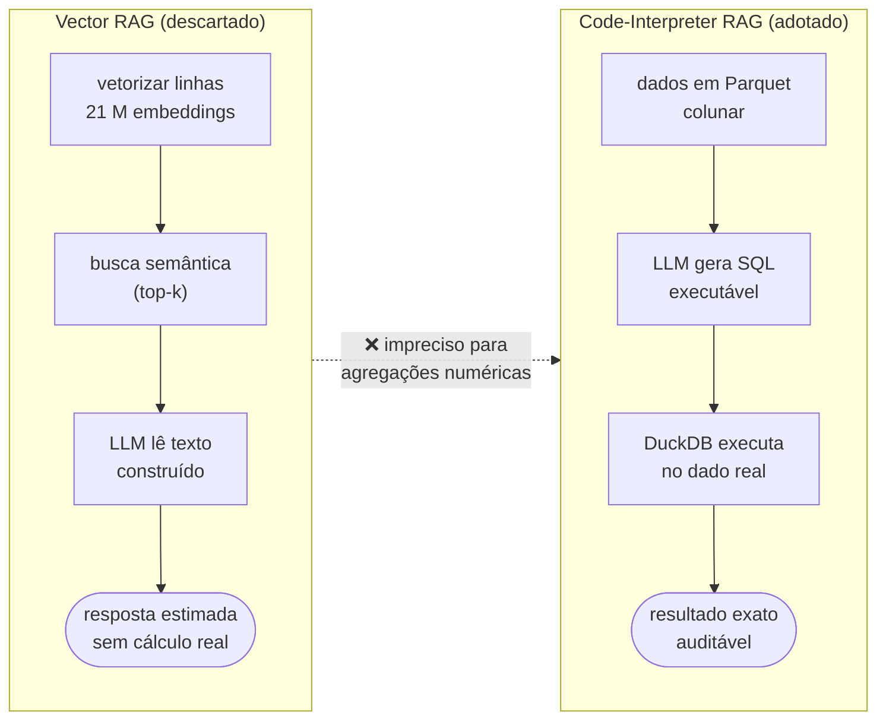

# Diagramas de Arquitetura — SUS Data RAG

Visão visual do pipeline, da camada de dados e da relação entre as views.

---

## 1. Pipeline end-to-end (Code-Interpreter RAG)

> **Princípio central:** o LLM nunca lê os dados brutos — gera SQL, recebe o agregado e explica o resultado.

---

## 2. Pipeline de ingestão e transformação de dados

---

## 3. Relação entre as views `processed` e `enriched`

> `enriched` é opcional: use apenas quando o filtro for por `clinical_interpretacao_clinica` ou `clinical_deslocamento_territorial`. Para filtros por `icd_group` ou `cid_principal`, consulte somente `processed`.

---

## 4. Decisão de design: por que Code-Interpreter RAG e não Vector RAG

[← Voltar ao índice](README.md)
